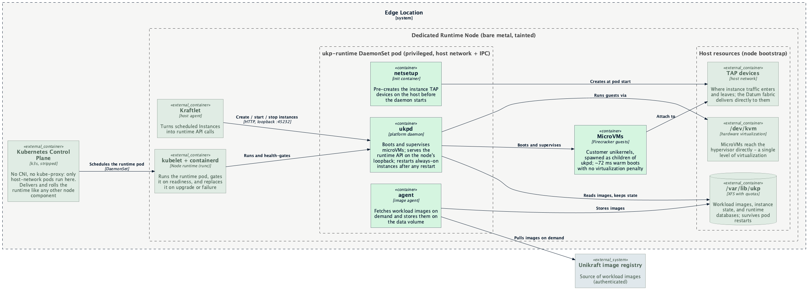

# Containerized Unikraft Runtime for Edge Compute Nodes

- [Summary](#summary)
- [Motivation](#motivation)
  - [Goals](#goals)
  - [Non-Goals](#non-goals)
- [Proposal](#proposal)
  - [User Stories](#user-stories)
  - [Notes/Constraints/Caveats](#notesconstraintscaveats)
  - [Risks and Mitigations](#risks-and-mitigations)
- [Design Details](#design-details)
  - [Runtime composition](#runtime-composition)
  - [Container image](#container-image)
  - [Node prerequisites](#node-prerequisites)
  - [Kubernetes runtime configuration](#kubernetes-runtime-configuration)
  - [Runtime DaemonSet](#runtime-daemonset)
  - [Container contract](#container-contract)
  - [Guest memory accounting](#guest-memory-accounting)
  - [Instance lifecycle and recovery](#instance-lifecycle-and-recovery)
  - [Measured results](#measured-results)
  - [Scale-to-zero gap and upstream asks](#scale-to-zero-gap-and-upstream-asks)
- [Production Readiness Review Questionnaire](#production-readiness-review-questionnaire)
- [Implementation History](#implementation-history)
- [Drawbacks](#drawbacks)
- [Alternatives](#alternatives)
- [Infrastructure Needed](#infrastructure-needed)

## Summary

Datum Cloud runs customer workloads as unikernel microVMs on the Unikraft
runtime. Today, standing up a Unikraft host is a manual, box-at-a-time
runbook: hand-ordering bare metal, partitioning and encrypting disks,
running a vendor install script, and editing systemd configuration over
SSH. This enhancement packages the Unikraft runtime as container images and
delivers it to bare-metal edge nodes as a Kubernetes DaemonSet, making the
runtime installable, upgradable, and observable like every other node
component in the platform.

A working prototype has validated the approach end to end on bare metal:
microVMs booted by the containerized runtime start in ~72 ms — slightly
faster than the ~82 ms measured on the vendor-configured native install —
confirming that containerizing the runtime adds **no virtualization
penalty**. The prototype also validated a slimmed-down runtime profile in
which Datum owns all ingress and network policy, and demonstrated automatic
workload recovery after a runtime upgrade or crash.

## Motivation

Operating edge locations at fleet scale requires the Unikraft runtime to be
a managed node component rather than a hand-installed appliance. The
current model has three structural problems:

1. **Provisioning does not scale.** Each box is installed by a person
   following a runbook (partitioning, LUKS setup, `curl | sh` installer,
   config edits). Adding an edge location is measured in hours of skilled
   labor, and configuration drift between boxes is unavoidable.
2. **Upgrades are unmanaged.** Runtime updates are apt operations performed
   over SSH per box, with no fleet-wide rollout, health gating, or
   rollback.
3. **The appliance owns the box.** The vendor install assumes it owns the
   machine's firewall, ingress proxy, DNS, and TLS issuance. Datum's
   platform owns networking, ingress, and policy enforcement at the edge;
   the runtime should provide exactly one thing — booting and managing
   microVMs — and integrate with the platform for everything else.

### Goals

- Deliver the Unikraft runtime components as container images deployed by a
  Kubernetes DaemonSet to dedicated bare-metal nodes.
- Preserve the product experience: no measurable penalty to microVM boot
  latency, density, or network performance versus the native install.
- Run the minimal runtime profile: Datum owns ingress (traffic delivered
  directly to instance TAP devices) and network policy; the runtime's
  built-in firewall, edge proxy, and certificate stack are not deployed.
- Workloads survive runtime lifecycle events: a runtime upgrade or crash
  results in a brief interruption with automatic recovery, not permanent
  workload loss.
- Node prerequisites (kernel modules, sysctls, data volume) are provisioned
  declaratively at node bootstrap.

### Non-Goals

- Modifying or forking the Unikraft runtime itself. Gaps that require
  upstream changes are tracked as explicit asks to Unikraft (see
  [Scale-to-zero gap and upstream asks](#scale-to-zero-gap-and-upstream-asks)).
- Live migration. Runtime restarts are not interruption-free, but they do
  not lose workloads: scale-to-zero-enabled guests are parked to a
  stateful snapshot on graceful shutdown and wake on their first packet
  (see [Instance lifecycle and recovery](#instance-lifecycle-and-recovery));
  other instances reboot via their restart policy.
- Sharing runtime nodes with general-purpose Kubernetes workloads. Runtime
  nodes are dedicated and tainted.
- The CNI/network-fabric integration for instance traffic (VRF/TAP/SRv6
  provisioning). That design is covered by the
  [instance provisioning enhancement](../instance-provisioning.md); this
  enhancement only requires that instances attach to TAP devices on the
  host.
- Scale-to-zero feature parity in the first release (pending an upstream
  API; see design details).

## Proposal

Package the eight Unikraft runtime Debian packages into a single container
image whose entrypoints are the runtime's own launcher scripts, and run
them as one privileged, host-network DaemonSet pod per node:

- an init container pre-creates the instance network (TAP) devices,
- the platform daemon (`ukpd`) boots and supervises microVMs via
  Firecracker,
- the image agent pulls workload images on demand,
- CoreDNS answers guest name resolution on the TAP gateway resolver
  address (guests have no other DNS path).

Runtime nodes run a minimal Kubernetes node configuration with no CNI and
no kube-proxy: only host-network pods are schedulable, which is exactly the
posture a dedicated microVM node requires. The runtime's API is served on
the node's loopback interface, where the platform's node agent (Kraftlet)
consumes it.



How to read it: the control plane delivers the runtime pod to each
dedicated node like any other node component; everything the runtime needs
from the host (KVM, TAP devices, the data volume) is prepared at node
bootstrap; Kraftlet drives workloads through the runtime's loopback API;
and customer microVMs reach the hypervisor directly — containerizing the
runtime adds no layer between a workload and the hardware.

Success is measured by the prototype's exit criteria, all of which have
been met on hardware: boot latency parity with the native install,
end-to-end instance lifecycle through the containerized runtime, and
automatic workload recovery from runtime restarts.

### User Stories

#### Story 1 — Adding edge capacity

An infrastructure operator joins a new bare-metal node to an edge
location's cluster. Node bootstrap applies the host prerequisites, the
scheduler places the runtime DaemonSet pod on the node, and within minutes
the node reports capacity for unikernel workloads. No SSH session is
involved.

#### Story 2 — Upgrading the fleet

A new runtime version ships as a new image tag. The operator updates the
DaemonSet; Kubernetes rolls it out node by node. On each node the runtime
parks running workloads into stateful snapshots during graceful
termination; they resume on their first request after the new runtime is
up (~1 s observed, one request pays it). A bad version is rolled back the
same way.

#### Story 3 — Provisioning workloads

The platform's node agent creates, starts, and stops instances through the
runtime API on the node's loopback interface, attaching each instance to
platform-provisioned network devices. Instances are reachable through the
Datum network fabric within ~100 ms of a start request.

### Notes/Constraints/Caveats

- **Runtime nodes are dedicated.** The pod is privileged, uses the host
  network and IPC namespaces, and (in the vendor's full profile) the
  runtime firewall rewrites host iptables with default-DROP policies. The
  minimal profile avoids the firewall entirely, but node dedication remains
  the operating assumption.
- **Guests are children of the runtime.** MicroVM processes (Firecracker)
  live inside the `ukpd` container's cgroup. Restarting the container kills
  running guests; recovery is automatic for instances created with
  `restart_policy: always` (see design details). Guest memory is accounted
  to the pod, so the pod runs without memory limits.
- **A vendor relationship is required for artifacts.** Runtime packages
  come from Unikraft's authenticated apt repository; credentials are needed
  at image build time only.

### Risks and Mitigations

| Risk | Mitigation |
| --- | --- |
| Runtime restarts interrupt guests | Graceful restarts park scale-to-zero guests into stateful snapshots that wake on first packet (validated); `restart_policy: always` backstops ungraceful kills (~10 s reboot, validated). Fleet upgrades roll node by node. |
| Guest memory charged to the pod cgroup could trigger OOM kills or evictions | No memory limits on the runtime pod; `priorityClassName: system-node-critical`; node capacity managed by the platform scheduler, not kubelet; kubelet `singleProcessOOMKill: true` so one guest's OOM cannot gang-kill every guest (see [Guest memory accounting](#guest-memory-accounting)). |
| Interrupted first boot leaves half-written runtime databases, and the daemon hangs (rather than exits) on corrupt state | Node bootstrap treats an interrupted first boot as "wipe the data directory"; raised with Unikraft as a robustness bug. |
| Runtime firewall (full profile) conflicts with Kubernetes networking | Minimal profile does not deploy the firewall. Nodes run CNI-less with kube-proxy disabled, so there are no competing iptables owners. Absent firewall state produces non-fatal runtime log errors (validated). |
| Vendor apt credentials leak via image layers | Credentials used only at build time via BuildKit secrets; images contain packages, not credentials. |
| Scale-to-zero does not function in the minimal profile | Interim: platform-driven stop/start (~100 ms effective cold-request latency at measured boot times). Long term: upstream API ask. |

## Design Details

### Runtime composition

The vendor install ships eight Debian packages. Their disposition in this
design:

| Component | Full (vendor parity) | Minimal (this proposal) | Notes |
| --- | --- | --- | --- |
| `ukpd` platform daemon + Firecracker fork | container | container | boots/supervises microVMs; API on `127.0.0.1:45232` + unix sockets |
| image agent | container | container | on-demand image pulls; has a soft (non-fatal) systemd health-check coupling |
| `netsetup` (TAP pre-creation) | init container | init container | 256 TAPs in <1 s; interim until instances attach to platform-created TAPs |
| firewall (iptables/ipset/TPROXY) | init container | **not deployed** | absence is non-fatal; Datum owns policy |
| OpenResty edge proxy | container | **not deployed** | Datum owns ingress; removal also drops all public ports |
| CoreDNS (internal DNS) | container | container | guests' only resolver is the host-side TAP gateway IP (pinned in ukpd's boot args); coredns must answer there or guests have **no DNS at all**, public names included |
| lego (ACME/TLS) | cron | **not deployed** | exists only to serve the proxy's certificates |
| config package | baked into image | baked into image | `/etc/ukp.conf` supplied by the platform |

All launchers are plain bash scripts that source `/etc/ukp.conf` and `exec`
a binary; systemd provides only ordering and restart policy on the native
install, both of which Kubernetes replaces (readiness probes replace the
vendor's `sleep 10` ordering hack).

### Container image

One image carries all components; per-service containers select their
entrypoint. Packages are installed from Unikraft's authenticated apt
repository at build time: the public signing keyring and deb822 source are
committed alongside the Dockerfile, while the repository credentials are
supplied through a BuildKit secret that exists only for the install step
and leaves no trace in any image layer. The image build lives at
[`build/ukp-runtime/`](../../../build/ukp-runtime/) and the deployment
manifests at
[`config/dependencies/ukp-runtime/`](../../../config/dependencies/ukp-runtime/).
### Node prerequisites

Applied at node bootstrap, outside the runtime containers:

- **Kernel modules**: `kvm`, `kvm_amd`/`kvm_intel`, `tun`. (No `vhost`
  modules are required — the Firecracker fork does TAP I/O in userspace.)
- **Data volume**: XFS mounted at `/var/lib/ukp` with
  `usrquota,grpquota,prjquota` (the runtime sets per-instance quotas). The
  prototype used RAID0 across two NVMe devices, matching the vendor layout
  minus disk encryption.
- **Sysctls**: the vendor's `20-ukp*.conf` set (`vm.swappiness=5`,
  rp_filter, syncookies, arp tuning). The vendor also sets
  `net.bridge.bridge-nf-call-iptables=0`, which conflicts with common CNIs;
  it is unnecessary on CNI-less runtime nodes.
- **CPU governor**: `performance`.

### Kubernetes runtime configuration

Runtime nodes are dedicated: no CNI, no kube-proxy, tainted. The evaluation
used single-node k3s; any conformant distribution works with the same
posture. Container runtime is containerd with runc — VM-isolated runtimes
(Kata, gVisor) must not be used for the runtime pod, as they would wrap
the VMM in a second virtualization layer.

```console
curl -sfL https://get.k3s.io | INSTALL_K3S_EXEC="server \
  --disable traefik,servicelb,metrics-server,local-storage,coredns \
  --flannel-backend=none --disable-network-policy \
  --disable-kube-proxy \
  --node-taint unikraft.datumapis.com/runtime=true:NoSchedule" sh -
```

A CNI-less node never reports `Ready`, so it permanently carries
`node.kubernetes.io/not-ready:NoSchedule`. The runtime DaemonSet therefore
tolerates all taints, exactly as CNI and kube-proxy DaemonSets do. Runtime
nodes also set the kubelet's `singleProcessOOMKill: true` — see
[Guest memory accounting](#guest-memory-accounting).

### Runtime DaemonSet

The runtime ships as one DaemonSet pod per dedicated node (canonical
manifests: [`config/dependencies/ukp-runtime/`](../../../config/dependencies/ukp-runtime/)).
The shape of the pod, as deployed and validated:

- **Placement** — tolerates all taints, exactly as CNI and kube-proxy
  DaemonSets do: runtime nodes are deliberately CNI-less and therefore
  permanently `NotReady`. `system-node-critical` priority keeps the pod
  out of kubelet eviction entirely.
- **Privileges and namespaces** — privileged containers in the host
  network and IPC namespaces, per the
  [container contract](#container-contract).
- **Containers** — a `netsetup` init container pre-creates the instance
  TAP devices; `ukpd`, the image agent, and CoreDNS then run as
  long-lived containers over shared hostPath mounts (`/var/lib/ukp`
  data, `/var/run/ukp` sockets, `/var/log/ukp`).
- **Health** — readiness is a TCP probe against the daemon's loopback
  API; the runtime exposes no unauthenticated HTTP endpoint, so an HTTP
  probe is not possible. There is deliberately no liveness probe: a
  false-positive restart would interrupt every guest on the node.
- **Resources** — no memory limits; guest RAM is charged to the pod (see
  [Guest memory accounting](#guest-memory-accounting)).
- **Shutdown** — the termination grace period is sized so the daemon can
  park every guest on the node (see
  [Instance lifecycle and recovery](#instance-lifecycle-and-recovery)).

Runtime configuration is injected as a ConfigMap: kustomize's
`configMapGenerator` builds `ukp-runtime-config` from the `ukp.conf` in the
same directory, and the hash-suffixed name means configuration changes roll
the DaemonSet automatically. Credentials never enter the ConfigMap — the
config file ends by sourcing an optional `ukp-runtime-credentials` Secret
(mounted at `/etc/ukp-secrets/`), which overlays values such as the agent
pull tokens; because the launchers source configuration as bash, the
overlay requires no changes to the runtime. Without the Secret the runtime
serves already-pulled images but cannot fetch new ones. First-boot
user/database seeding (users.json) remains a node bootstrap step.

### DNS on Talos (hostDNS coexistence)

Guests are pinned (via `ukpd` boot args, `netdev.ip=…:<gateway>:<dns>…` with
`dns == gateway`) to use their own host-side TAP gateway IP as their *only*
resolver, so CoreDNS must answer on every isolate gateway. The catch on Talos:
the vendor `ukp-coredns` (CoreDNS 1.14.4) is a **stripped build with no `bind`
plugin** (`coredns -plugins` omits it, and an IP in the server-block header is
parsed as a zone, not a listen address), so CoreDNS can only bind the wildcard
`.:53`. That collides with Talos **hostDNS** on `127.0.0.53:53` and CrashLoops
the container. We cannot rebuild the binary either — the `ukpdns` plugin that
answers `.internal` from `ukpd`'s iDNS socket is proprietary and compiled in.

The fix keeps CoreDNS but changes how it is launched (entrypoint
[`build/ukp-runtime/coredns-redirect.sh`](../../../build/ukp-runtime/coredns-redirect.sh)):
CoreDNS runs on a non-colliding wildcard port `UKP_DNS_PORT` (default `5300`)
and forwards everything outside `internal.` to `UKP_DNS_UPSTREAM` (default the
Talos hostDNS `127.0.0.53:53`; set a public resolver on non-Talos hosts). An
nftables table then DNATs the guest path to it — a single
`iifname "ukp*" dport 53 → :5300` redirect that covers all current and future
`ukp<netid>.vif*` gateways with no enumeration, plus a mandatory `input` chain
that drops direct hits on the alt port from the node's real NICs (only
redirected guest traffic and host loopback reach it, so it is not an open
resolver). The table is replaced wholesale on each start, so it is idempotent
across restarts. **Talos hostDNS is left untouched** on `127.0.0.53:53` — no
host-OS change is required. Both `UKP_DNS_PORT` and `UKP_DNS_UPSTREAM` are
`ukp.conf` knobs. (Upstream ask: have Unikraft ship the `bind` plugin, or an
upstream-forwarder override, in `ukp-coredns` — that would let CoreDNS bind the
gateway IPs directly and retire the redirect.)

### Container contract

The complete host contract, reverse-engineered from a live vendor install
and validated by the prototype:

| Requirement | Detail |
| --- | --- |
| Devices | `/dev/kvm` (KVM ioctls), `/dev/net/tun` (TAP fds, inherited by the VMM) |
| Namespaces | `hostNetwork` (TAPs live in the host netns; API on host loopback), `hostIPC` (shared-memory notify channels between daemon and VMM) |
| Privileges | privileged pod (writes `/sys/module/kvm/parameters/nx_huge_pages`, patches a udev rule, TAP administration, XFS quota calls) |
| Storage | `/var/lib/ukp` hostPath on XFS with quota mount options; `/var/run/ukp` (unix sockets) and `/var/log/ukp` hostPaths |
| Users | `ukpvol` system user in-image (storage quota ownership) |
| VMM placement | Firecracker (a Unikraft fork, no jailer) runs as a direct child of `ukpd`, inside the pod cgroup |

### Guest memory accounting

Firecracker guests are children of `ukpd`, so guest RAM is charged to the
runtime pod's memory cgroup. On a dedicated node this accounting is honest
— the pod really is what consumes the memory — and the mature
VM-on-Kubernetes stacks (KubeVirt, Kata Containers) deliberately model
guest memory as pod-level resources rather than hiding it. This design
therefore does not exclude guest memory from the pod's accounting; it
defuses the two consequences of counting it:

- **Eviction**: `system-node-critical` removes the pod from kubelet's
  eviction ranking entirely (and sets `oom_score_adj` to −997); node
  memory for the OS and kubelet is carved out with
  `system-reserved`/`kube-reserved`, and the platform scheduler — not
  kubelet — owns guest capacity.
- **OOM blast radius**: on cgroup v2, Kubernetes ≥1.28 sets
  `memory.oom.group=1` on container cgroups, so a kernel OOM selecting the
  runtime container would kill **every guest on the node at once**
  (verified on the prototype deployment). Runtime nodes must set the
  kubelet's `singleProcessOOMKill: true` (available since v1.32) to
  restore per-process OOM semantics.

Considered and not pursued:

- **Per-guest delegated cgroups** (Kata-style) would add per-guest OOM
  isolation and per-guest metrics, but the daemon would have to place each
  VMM in its own cgroup *before* guest memory is faulted in — cgroup v2
  charges pages to the cgroup that first touches them, and migrating a
  process does not move existing charges. Realistically an upstream `ukpd`
  feature; listed in the open questions.
- **Hugepage-backed guest memory** would move guest RAM to the hugetlb
  controller and model it as an explicit `hugepages-2Mi` node resource,
  but hugepages are pinned and non-overcommittable, mutually exclusive
  with Firecracker's balloon device, and incompatible with the memfd-based
  standby model — abandoning memory overcommit is too high a price for
  cleaner accounting.

### Instance lifecycle and recovery

- Lifecycle verbs on the runtime API are `PUT`
  (`/v1/instances/{uuid}/start|stop|suspend`).
- **Graceful runtime restarts park guests instead of killing them.** On
  SIGTERM, `ukpd` places scale-to-zero-enabled instances into `standby`
  (stateful snapshot; `start_count` unchanged); after the replacement pod
  is up, the first packet to the instance wakes it (~1 s observed
  round-trip including post-restart warmup). Validated on both the native
  install (systemd restart) and the k8s minimal profile (graceful pod
  delete). Long-running instances should therefore be created with
  `scale_to_zero: {stateful: true}` — in the minimal profile idle-parking
  never triggers (no proxy stats), so the setting functions purely as
  shutdown persistence. The DaemonSet's `terminationGracePeriodSeconds`
  must cover parking every guest on a dense node. Open verification:
  proving the woken guest retains memory contents across a pod
  replacement (vs a silent reboot) needs an in-guest marker test.
- `restart_policy: always` (create-time only; not patchable) makes `ukpd`
  re-boot an instance whenever the daemon itself starts. This is the
  backstop for instances without scale-to-zero and for **ungraceful**
  kills (SIGKILL/OOM bypass parking), and it held across every restart
  mode tested (container restart, pod deletion, full stack
  teardown/rebuild).
- Graceful daemon shutdown (SIGTERM) is clean: databases flush, instance
  bookkeeping survives, restarts recover. Hard kills mid-first-boot corrupt
  the runtime databases and the daemon *hangs* on the corrupt state at next
  start — the bootstrap wipe rule and an upstream robustness ask cover
  this.

### Measured results

Validated 2026-07-02 on a blank bare-metal box (Debian 13, EPYC 9355P,
2×1.7 TB NVMe), first under docker compose, then under k3s as the
DaemonSet above. Reference numbers from the vendor-configured native
install on a comparable box.

| Measurement | Result |
| --- | --- |
| Warm boot, Go HTTP image, containerized (5-cycle) | **71.0–73.0 ms** (mean ~72.0) |
| Warm boot, Go HTTP image, native vendor install (5-cycle) | 81.9–82.3 ms (mean ~82.1) |
| Warm boot, nginx image, containerized | **23.5–23.6 ms** |
| Guest HTTP over TAP | 200 OK, <1 ms |
| Cold start incl. on-demand image pull | ~6.6 s |
| Pod delete → guest serving again | ~10 s (automatic) |

Test methodology and per-cycle raw numbers are recorded in the
[investigation document](./investigation.md#confirming-an-instance-comes-online).
Boot time is dominated by the guest image (the Go runtime accounts for
~50 ms), not the platform. The containerized runtime measured consistently
*faster* than the native reference for identical operations and image
digests; the delta attributable to containerization is zero or negative.

### Scale-to-zero gap and upstream asks

In the minimal profile, instances never enter `standby` (the parked,
wake-on-traffic state): idle detection is implemented in the vendor's edge
proxy, which this design does not deploy. `suspend` produces `stopped`,
which does not wake on traffic. Waking *from* `standby` works without the
proxy (validated on the vendor install: a packet arriving on the instance
TAP wakes it).

The platform components are closed-source, with no public self-hosting or
containerization documentation (the
[`unikraft-cloud/openapi`](https://github.com/unikraft-cloud/openapi) spec
is the most authoritative public artifact of the API surface), so these
need answers from Unikraft directly — in priority order:

1. **External TAP attach** — bind an instance to a platform-created TAP
   device instead of the runtime-owned pre-created pool. (Upstream
   Firecracker already supports this; the ask is at the `ukpd` layer.)
2. **API-driven standby** — a verb to place an instance directly into
   `standby`, so the platform can drive scale-to-zero policy itself.
3. **Fail-fast on corrupt state** — `ukpd` should exit, not hang, when its
   databases fail integrity checks, so orchestrators can act.
4. **Supported headless mode** — bless the daemon+agent-only profile as a
   supported configuration.

Further open questions:

- The intended fate of standby state (held in a daemon memfd) when the
  runtime container restarts or the pod is rescheduled.
- Credentials/channel pinning for building images against the vendor's
  staging/preview package channels for edge rollouts.
- Public distribution of the apt repository signing key (today it is
  obtainable only from an existing installation, so this repository pins a
  vendored copy with its fingerprint documented).
- Per-guest cgroup placement: whether `ukpd` can put each VMM child in its
  own delegated child cgroup (the native systemd unit already runs with
  `Delegate=yes`), enabling per-guest OOM isolation and metrics.

Interim scale-to-zero: the platform stops idle instances and starts them on
demand; at measured boot times this costs ~100 ms on the first request.

## Production Readiness Review Questionnaire

### Feature Enablement and Rollback

#### How can this feature be enabled / disabled in a live cluster?

- [x] Other
  - Describe the mechanism: deploying (or deleting) the `ukp-runtime`
    DaemonSet in a cluster whose runtime nodes carry the
    `unikraft.datumapis.com/runtime` taint.
  - Will enabling / disabling the feature require downtime of the control
    plane? No.
  - Will enabling / disabling the feature require downtime or
    reprovisioning of a node? Enabling requires node bootstrap
    (modules/sysctls/data volume). Disabling stops all microVMs on the
    node.

#### Does enabling the feature change any default behavior?

No. Runtime nodes are dedicated and tainted; no other workloads are
affected.

#### Can the feature be disabled once it has been enabled (i.e. can we roll back the enablement)?

Yes — delete the DaemonSet (guests on affected nodes stop) or roll back the
image tag (guests blip and auto-recover). Runtime state under
`/var/lib/ukp` survives and is forward/backward compatible per vendor
packaging.

#### What happens if we reenable the feature if it was previously rolled back?

The daemon reopens its databases and restarts `restart_policy: always`
instances; validated across teardown/rebuild cycles.

#### Are there any tests for feature enablement/disablement?

A validation battery (bringup, instance lifecycle, restart blast radius,
minimal-profile behavior) was run against the prototype on bare metal; the
results are recorded in [Measured results](#measured-results). The runtime
is not tested in isolation — it is exercised through the standard control
plane e2e, which deploys the runtime behind Kraftlet and drives it through
the compute API (see the chainsaw test at
[`test/e2e/instance/02-run-instance`](../../../test/e2e/instance/02-run-instance)),
asserting that an `Instance` created through the API starts a running
microVM on the runtime and that the workload serves HTTP over the network.
CI runners use nested virtualization, so the e2e asserts function; latency
numbers remain the bare-metal validation's job.

### Rollout, Upgrade and Rollback Planning

Rollout is a standard DaemonSet image update, node by node. Workloads on a
node see a ~10 s interruption during the pod replacement; instances without
`restart_policy: always` do not come back automatically — the platform
must ensure every instance it creates sets it. The signals for rollback are
the runtime readiness probe and instance recovery failures after pod
replacement.

### Monitoring Requirements

The runtime exposes Prometheus metrics (token-gated endpoint) and per-node
health via the DaemonSet readiness probe. SLO/SLI definitions are future
work for beta; the natural SLIs are instance start latency
(`boot_time_us`), instance recovery success rate after pod restart, and
runtime API availability on loopback.

### Dependencies

- Unikraft apt repository (build time only; nodes do not contact it).
- Unikraft image registry/NATS for workload image pulls (runtime degrades
  to serving existing local images if unavailable).
- Host prerequisites listed in [Node prerequisites](#node-prerequisites).

### Scalability

No new API types and no new control-plane calls: the runtime pod is a
standard DaemonSet; instance operations flow through the runtime's local
API, not the Kubernetes API. Per-node footprint: 256 pre-created TAP
devices (<1 s to create), ~80 MB of runtime databases on first boot, and
guest memory accounted to the pod cgroup (hence no pod memory limit).

### Troubleshooting

- Runtime pod not ready: check the `ukpd` container log and
  `/var/log/ukp/platform/ukpd.log` on the node. A daemon that starts but
  never becomes ready after an unclean node event may indicate corrupt
  runtime databases (see the bootstrap wipe rule).
- Instances did not recover after a pod restart: verify they were created
  with `restart_policy: always` (create-time only).
- Image pulls failing: agent logs; systemd health-check errors from the
  agent are known noise (soft coupling), pull errors are not.

## Implementation History

- 2026-07-02: Reverse-engineering of a live vendor install; the raw
  findings are recorded in [investigation.md](./investigation.md).
- 2026-07-02: Prototype validated on bare metal under docker compose and
  k3s (measurements above); evaluation tracked in
  [datum-cloud/infra#3021](https://github.com/datum-cloud/infra/issues/3021).
- 2026-07-02: Enhancement drafted (provisional).

## Drawbacks

- Runtime nodes are single-purpose; the platform carries the cost of
  dedicated capacity per edge location.
- The containerized packaging is Datum-maintained and diverges from the
  vendor's supported install path until Unikraft blesses a headless
  containerized profile (upstream ask #4).
- Guest interruption on runtime upgrades is inherent to the current process
  model (VMM as child of the daemon); zero-blip upgrades would require
  upstream changes (e.g., VMM re-parenting or live handoff).

## Alternatives

- **Automate the existing runbook (Ansible/SSH).** Removes some manual
  labor but keeps the appliance model: no fleet rollout/rollback, no
  health gating, and the vendor stack still owns the box's networking.
- **Run the full vendor stack in containers (parity profile).** Validated
  and works, but deploys an ingress proxy, DNS, TLS issuance, and a
  host-firewall takeover that Datum's platform replaces; the firewall's
  default-DROP rewrite of host iptables is fundamentally hostile to
  sharing a node with anything else.
- **VM-isolated runtime pod (Kata/gVisor).** Rejected: wraps the VMM in a
  second virtualization layer, reintroducing the nested-virtualization
  penalty this design exists to avoid.
- **Wait for official upstream containerization.** No public timeline; the
  platform's self-hosting needs are documented nowhere upstream. The
  prototype de-risks acting now, and the upstream asks are narrow.

## Infrastructure Needed

- Dedicated bare-metal nodes with hardware virtualization (KVM) per edge
  location.
- Unikraft apt repository credentials for image builds (build-time secret).
- Registry space for the runtime image (e.g., `ghcr.io/datum-cloud/ukp-runtime`).
