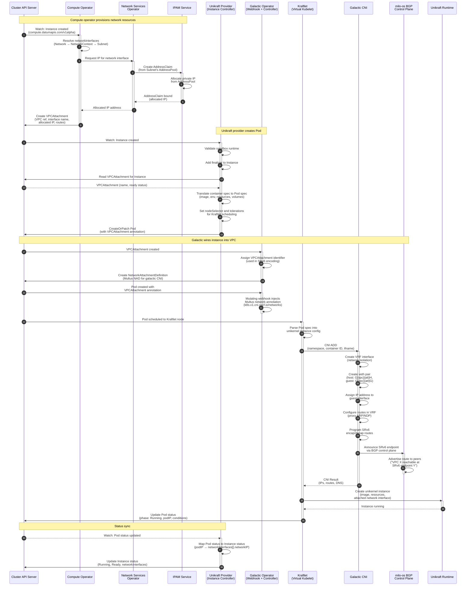
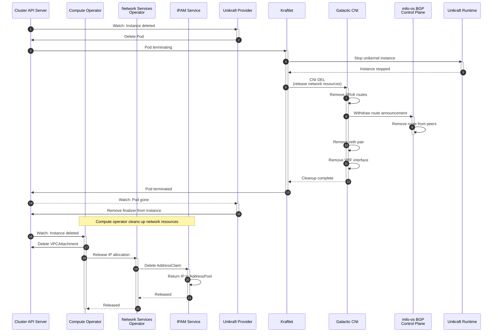

# Instance Provisioning via Kraftlet

## Instance Provisioning Flow

```mermaid
%%{init: {
  "sequence": {
    "showSequenceNumbers": true
  }
}}%%
sequenceDiagram
    participant API as Cluster API Server
    participant CO as Compute Operator
    participant NSO as Network Services<br/>Operator
    participant IPAM as IPAM Service
    participant UP as Unikraft Provider<br/>(Instance Controller)
    participant GO as Galactic Operator<br/>(Webhook + Controller)
    participant KL as Kraftlet<br/>(Virtual Kubelet)
    participant GCNI as Galactic CNI
    participant BGP as milo-os BGP<br/>Control Plane
    participant UK as Unikraft Runtime

    Note over API,IPAM: Compute operator provisions network resources

    API->>CO: Watch: Instance created<br/>(compute.datumapis.com/v1alpha)
    activate CO
    CO->>CO: Resolve networkInterfaces<br/>(Network → NetworkContext → Subnet)
    CO->>NSO: Request IP for network interface
    activate NSO
    NSO->>IPAM: Create AddressClaim<br/>(from Subnet's AddressPool)
    activate IPAM
    IPAM->>IPAM: Allocate private IP<br/>from AddressPool
    IPAM-->>NSO: AddressClaim bound<br/>(allocated IP)
    deactivate IPAM
    NSO-->>CO: Allocated IP address
    deactivate NSO
    CO->>API: Create VPCAttachment<br/>(VPC ref, interface name,<br/>allocated IP, routes)
    deactivate CO

    Note over UP,GO: Unikraft provider creates Pod

    API->>UP: Watch: Instance created
    activate UP
    UP->>UP: Validate sandbox runtime
    UP->>UP: Add finalizer to Instance
    UP->>API: Read VPCAttachment for Instance
    API-->>UP: VPCAttachment (name, ready status)
    UP->>UP: Translate container spec to Pod spec<br/>(image, env, resources, volumes)
    UP->>UP: Set nodeSelector and tolerations<br/>for Kraftlet scheduling
    UP->>API: CreateOrPatch Pod<br/>(with VPCAttachment annotation)
    deactivate UP

    Note over API,BGP: Galactic wires instance into VPC

    API->>GO: VPCAttachment created
    activate GO
    GO->>GO: Assign VPCAttachment identifier<br/>(used in SRv6 encoding)
    GO->>API: Create NetworkAttachmentDefinition<br/>(Multus NAD for galactic CNI)
    deactivate GO

    API->>GO: Pod created with<br/>VPCAttachment annotation
    activate GO
    GO->>GO: Mutating webhook injects<br/>Multus network annotation<br/>(k8s.v1.cni.cncf.io/networks)
    deactivate GO

    API->>KL: Pod scheduled to Kraftlet node
    activate KL

    KL->>KL: Parse Pod spec into<br/>unikernel instance config

    KL->>GCNI: CNI ADD<br/>(namespace, container ID, ifname)
    activate GCNI
    GCNI->>GCNI: Create VRF interface<br/>(network isolation)
    GCNI->>GCNI: Create veth pair<br/>(host: G{vpc}{att}H,<br/> guest: G{vpc}{att}G)
    GCNI->>GCNI: Assign IP address to<br/>guest interface
    GCNI->>GCNI: Configure routes in VRF<br/>(proxy ARP/NDP)
    GCNI->>GCNI: Program SRv6<br/>encap/decap routes
    GCNI->>BGP: Announce SRv6 endpoint<br/>via BGP control plane
    activate BGP
    BGP->>BGP: Advertise route to peers<br/>("VPC X reachable at<br/>SRv6 endpoint Y")
    deactivate BGP
    GCNI-->>KL: CNI Result<br/>(IPs, routes, DNS)
    deactivate GCNI

    KL->>UK: Create unikernel instance<br/>(image, resources,<br/>attached network interface)
    activate UK
    UK-->>KL: Instance running
    deactivate UK

    KL->>API: Update Pod status<br/>(phase: Running, podIP, conditions)
    deactivate KL

    Note over API,UP: Status sync

    API-->>UP: Watch: Pod status updated
    activate UP
    UP->>UP: Map Pod status to Instance status<br/>(podIP → networkInterfaces[].networkIP)
    UP->>API: Update Instance status<br/>(Running, Ready, networkInterfaces)
    deactivate UP
```

## Instance Deletion Flow

```mermaid
%%{init: {
  "sequence": {
    "showSequenceNumbers": true
  }
}}%%
sequenceDiagram
    participant API as Cluster API Server
    participant CO as Compute Operator
    participant NSO as Network Services<br/>Operator
    participant IPAM as IPAM Service
    participant UP as Unikraft Provider
    participant KL as Kraftlet
    participant GCNI as Galactic CNI
    participant BGP as milo-os BGP<br/>Control Plane
    participant UK as Unikraft Runtime

    API->>UP: Watch: Instance deleted
    activate UP
    UP->>API: Delete Pod
    deactivate UP

    API->>KL: Pod terminating
    activate KL

    KL->>UK: Stop unikernel instance
    activate UK
    UK-->>KL: Instance stopped
    deactivate UK

    KL->>GCNI: CNI DEL<br/>(release network resources)
    activate GCNI
    GCNI->>GCNI: Remove SRv6 routes
    GCNI->>BGP: Withdraw route announcement
    activate BGP
    BGP->>BGP: Remove route from peers
    deactivate BGP
    GCNI->>GCNI: Remove veth pair
    GCNI->>GCNI: Remove VRF interface
    GCNI-->>KL: Cleanup complete
    deactivate GCNI

    KL->>API: Pod terminated
    deactivate KL

    API-->>UP: Watch: Pod gone
    activate UP
    UP->>API: Remove finalizer from Instance
    deactivate UP

    Note over CO,IPAM: Compute operator cleans up network resources

    API->>CO: Watch: Instance deleted
    activate CO
    CO->>API: Delete VPCAttachment
    CO->>NSO: Release IP allocation
    activate NSO
    NSO->>IPAM: Delete AddressClaim
    activate IPAM
    IPAM->>IPAM: Return IP to AddressPool
    IPAM-->>NSO: Released
    deactivate IPAM
    NSO-->>CO: Released
    deactivate NSO
    deactivate CO
```
