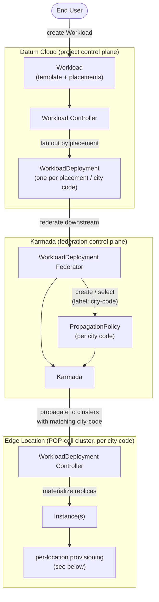
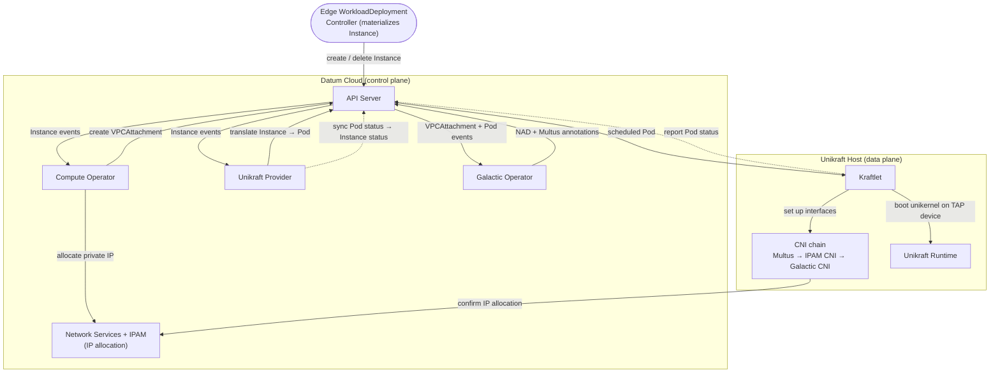
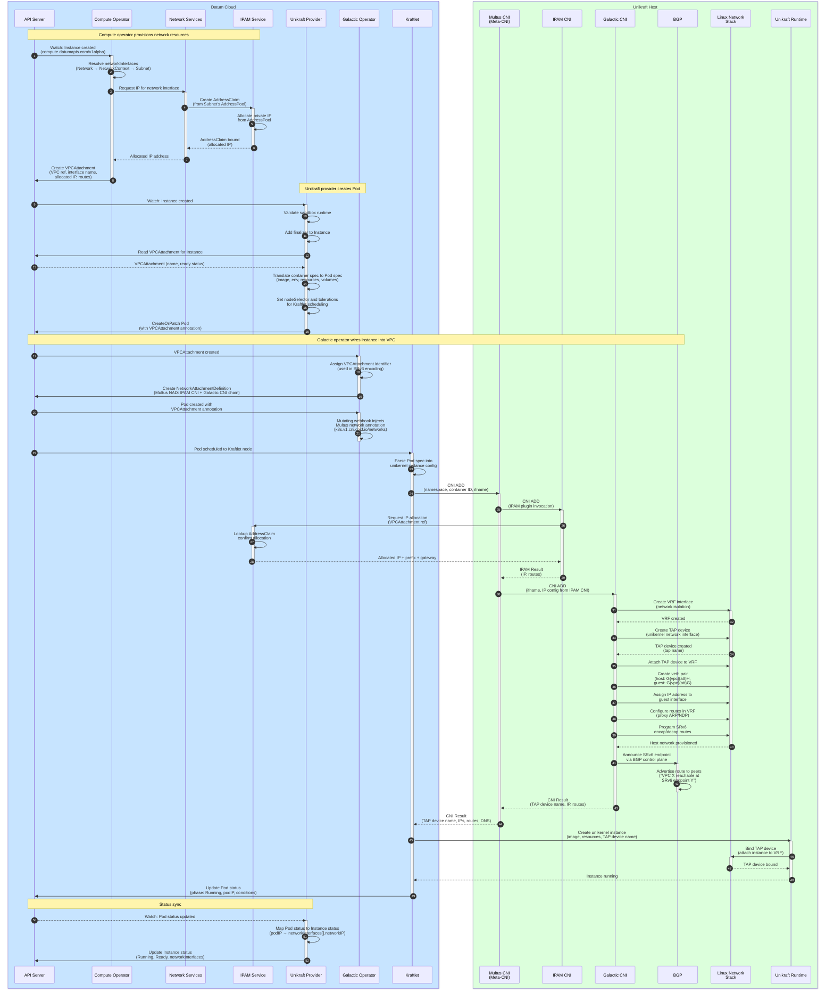
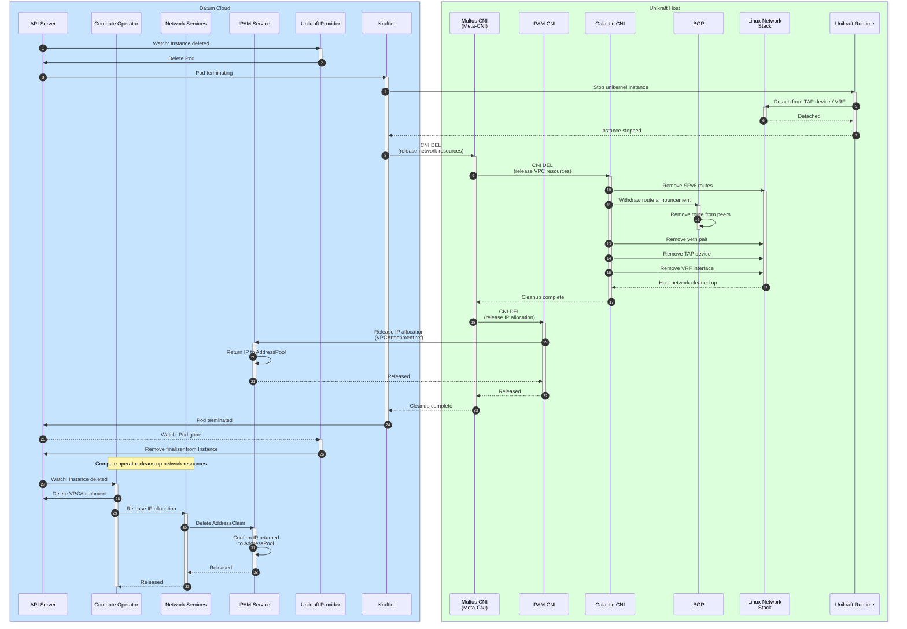

# Instance Provisioning via Kraftlet

## Architecture Overview

A Datum Cloud `Instance` does not start life as an `Instance` — it is the
edge-local materialization of a user-defined `Workload`. This section works
top-down: first the platform path that takes an end user's `Workload` and
federates it out to edge locations as `Instance`s, then the per-location
components that turn each `Instance` into a running unikernel. The sequence
diagrams later in this document trace the individual API calls and CNI
invocations for that per-location flow.

### From Workload to edge Instances

An end user declares a `Workload` describing what to run (an instance template)
and where to run it (one or more placements, each scoped to a set of city
codes). The platform fans that single declaration out across edge locations:

- **Workload** — the user-facing declaration: an instance template plus a list of placements, each naming the city codes it should run in and its scale settings.
- **Workload Controller** — reconciles a `Workload` into one `WorkloadDeployment` per placement/city code, applying the template and desired replica counts.
- **WorkloadDeployment Federator** — pushes each `WorkloadDeployment` to the downstream Karmada control plane and lazily maintains a `PropagationPolicy` per city code that selects the matching edge clusters. Status aggregated by Karmada is mirrored back up onto the source objects.
- **Karmada** — federation control plane that propagates each `WorkloadDeployment` to the POP-cell clusters whose city-code label matches its `PropagationPolicy`.
- **Edge Location (POP-cell cluster)** — a per-city-code member cluster. Its `WorkloadDeployment` controller materializes the actual `Instance` replicas, each of which is then provisioned by the per-location components described next.

### Within an edge location

Once an `Instance` exists in an edge location, several control-plane components
cooperate to turn that declarative `Instance` into a running, network-attached
unikernel, and a host-side agent drives the actual boot and networking. The
following describes those components and how they interact at a coarse grain.

### Component responsibilities

| Component | Role |
| --- | --- |
| **API Server** | Stores the desired state (`Instance`, `Pod`, `VPCAttachment`, `NetworkAttachmentDefinition`) and is the event bus every other component watches. |
| **Compute Operator** | Owns the network prerequisites for an `Instance`: resolves its network interfaces, drives IP allocation, and creates/deletes the `VPCAttachment`. |
| **Network Services + IPAM** | Allocate and release private IPs from a subnet's address pool, backing both the up-front `AddressClaim` and the CNI-time lookup. |
| **Unikraft Provider** | Translates an `Instance` into a `Pod` targeted at a Kraftlet node, and syncs the resulting `Pod` status back onto the `Instance`. Owns the `Instance` finalizer. |
| **Galactic Operator** | Wires the instance into its VPC: builds the `NetworkAttachmentDefinition` (CNI chain) for a `VPCAttachment` and injects the Multus network annotation onto the `Pod`. |
| **Kraftlet** | Host agent that picks up scheduled `Pod`s, parses them into a unikernel config, drives the CNI chain to provision host networking, boots the unikernel, and reports `Pod` status. |
| **CNI chain (Multus → IPAM CNI → Galactic CNI)** | Provisions the host-side network: confirms the IP allocation, then creates the VRF/TAP/veth plumbing and programs SRv6 + BGP routing for the VPC. |
| **Unikraft Runtime** | Boots and runs the unikernel instance, attaching it to the TAP device prepared by the CNI chain. |

### Lifecycle at a glance

0. **Materialization** — federation lands a `WorkloadDeployment` in the edge location, whose controller creates the `Instance` that the steps below act on.
1. **Network prerequisites** — the Compute Operator reacts to a new `Instance`, allocates a private IP, and records a `VPCAttachment`.
2. **Pod creation** — the Unikraft Provider translates the `Instance` into a `Pod` bound for a Kraftlet node.
3. **VPC wiring** — the Galactic Operator prepares the CNI chain definition and annotates the `Pod` for Multus.
4. **Boot** — Kraftlet provisions host networking through the CNI chain and boots the unikernel.
5. **Status sync** — `Pod` status flows back through the Unikraft Provider onto the `Instance`.
6. **Teardown** — deletion unwinds the same path in reverse, releasing host networking, the `Pod`, the `VPCAttachment`, and the IP allocation.

## Instance Provisioning Flow

## Instance Deletion Flow

