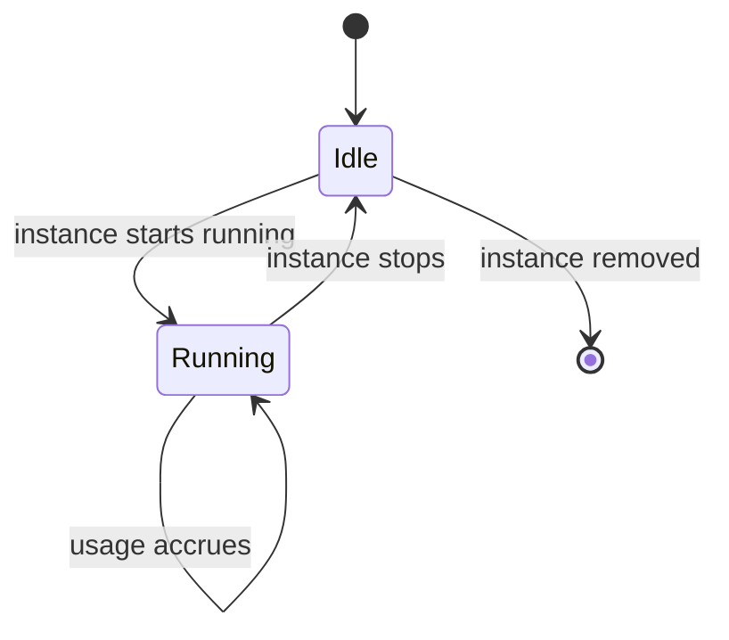

# Usage Metering for the Unikraft Runtime

**Issue:** [datum-cloud/unikraft-provider#5](https://github.com/datum-cloud/unikraft-provider/issues/5)

- [Summary](#summary)
- [Motivation](#motivation)
  - [Goals](#goals)
  - [Non-Goals](#non-goals)
- [Proposal](#proposal)
  - [Where This Fits](#where-this-fits)
  - [User Stories](#user-stories)
  - [How It Works](#how-it-works)
  - [Risks and Mitigations](#risks-and-mitigations)
- [Design Details](#design-details)
  - [The Per-Node Metering Component](#the-per-node-metering-component)
  - [The Shipping Step](#the-shipping-step)
- [Technical Details](#technical-details)
- [Drawbacks](#drawbacks)
- [Alternatives](#alternatives)
- [Implementation History](#implementation-history)
- [Infrastructure Needed](#infrastructure-needed)

## Summary

Today, running a Unikraft instance produces no usage data at all. The runtime is a
vendor-built system that only knows about virtual machines — it has no idea what a
project or a customer is, and no notion of billing. This enhancement adds a small
component, running on every node, that watches each instance's real lifecycle as it
happens and turns it into an accurate record: which project it belongs to, and exactly
how long it actually ran.

That record is the raw material a second, much simpler step will use: reading it and
forwarding it, in the platform's standard format, to wherever usage is ultimately
metered and billed. The first half — producing an accurate, attributed usage record —
is built and has been validated end to end. The second half — shipping that record
onward — is the next step, and is a comparatively small piece of work, because the hard
problem here was never "how do we move data," it was "how do we know, correctly, what
happened and to whom."

## Motivation

The Unikraft runtime runs customer workloads as microVMs, but it was never built with
Datum's platform in mind. Left as-is, that creates three problems:

1. **No attribution.** The runtime has no concept of a project or a customer — it just
   knows a virtual machine started or stopped. Nothing connects that back to who should
   be billed.
2. **No accurate timing.** A workload that runs for ten seconds and one that runs for a
   week look identical unless something is actually tracking how long each one
   consumed resources.
3. **No usable output.** Even if the above were solved, there's nowhere for that
   information to go — no record a billing system could read.

Solving this means customers are charged for what they actually used, and only for as
long as they actually used it — not for whether they happened to leave something
provisioned.

### Goals

- Every instance's actual running time is measured accurately and attributed to the
  right project.
- Idle, stopped, or parked time is never counted — only time actually spent running.
- The measurement survives ordinary operational hiccups (a restart, a brief outage)
  without losing usage or counting it twice.
- The record this produces is self-contained and easy for anything downstream to
  consume, without needing to understand how the Unikraft runtime itself works.
- When something can't be measured correctly (for example, an instance whose project
  can't be determined), that's visible and loud — never a silent, wrong number.

### Non-Goals

- **Pricing, invoicing, or deciding what usage costs.** This produces usage data; it
  does not decide what anyone owes.
- **Metering anything that isn't actually running.** Reserved-but-idle capacity isn't
  billed through this mechanism.
- **The full path to the central billing system, end to end, right now.** This covers
  producing an accurate record on each node and the plan for shipping it onward. Full
  validation of the shipping step is sequenced behind the compute service reliably
  running real instances — this document says so plainly rather than assuming it
  around.

## Proposal

### Where This Fits

On every node that runs Unikraft instances, this component sits alongside the runtime
itself and watches its instance lifecycle directly, as it happens. It has no opinion
about pricing or invoicing — its only job is to answer, accurately: did this instance
run, for how long, and whose project was it.

### User Stories

**A short-lived workload is billed fairly.** A customer runs an instance for twelve
seconds. That's exactly what gets measured and attributed — not a rounded-up minimum,
not the length of some unrelated reporting interval.

**Idle costs nothing.** An instance that's provisioned but not actually running
accrues no usage while it sits idle. The moment it starts running again, measurement
picks back up.

**An operator trusts the numbers.** Whether the metering component restarts, or a
usage window is reported more than once due to a retry, the number that ultimately
lands is correct — never doubled, never silently lost.

**A misconfiguration is caught, not hidden.** If an instance's project can't be
determined for some reason, that's flagged loudly and visibly rather than quietly
attributing usage to the wrong place, or dropping it.

### How It Works

For each instance, the component watches for the moment it's actually running, and the
moment it stops. While it's running, that's a clock ticking; the moment it stops, the
clock closes and the elapsed time — along with how large the instance was (how much
compute and memory it used) — becomes one usage record, correctly attributed to the
right project. A long-running instance also reports incrementally along the way, so
usage is visible without having to wait for it to eventually stop.

This has already been built and validated end to end in a full simulated environment,
and is now deployed and running on real infrastructure. What's still outstanding is
confirming it against real, live traffic — which is waiting on the compute service
reliably getting instances to a running state there, not on anything this component
still needs to do.

### Risks and Mitigations

- **An instance's project can't be determined.** Rather than guessing or silently
  attributing it to the wrong place, this is flagged clearly and the usage is still
  recorded with an explicit "unknown" marker — so the underlying data isn't lost and
  can be reconciled once the cause is fixed.
- **The component itself has an outage.** Any gap is bounded and self-heals on
  restart; a retried report never counts the same usage twice.
- **Local usage data could grow without bound.** The component manages this on its
  own, keeping only what's needed until the shipping step (once it exists) has
  confirmed it was picked up.
- **This can't be fully proven until the compute service is reliably running real
  instances.** That's a sequencing fact, not a flaw in this design — it's called out
  here rather than glossed over.

## Design Details

### The Per-Node Metering Component

One instance of this component runs on every node that hosts the Unikraft runtime,
because the fine-grained detail of exactly when an instance starts and stops running
is only visible right there, at the source. A central view of the fleet, elsewhere,
would not have that same immediacy or precision.

### The Shipping Step

The next piece of work is comparatively small: a lightweight, widely used
data-shipping tool will read the usage records this component produces and forward
them — translated into the platform's standard usage format — to wherever usage is
ultimately metered and billed. Because the hard problem (accurate measurement and
attribution) is already solved, this step is mostly about transport and format, not
new logic.

## Technical Details

The metering component is a small program written in Go, running as a sidecar
container inside the same per-node pod as the Unikraft runtime itself — one per
compute node, deployed and upgraded alongside the runtime rather than as a separate
rollout. It connects directly to the runtime's own local event stream on that node, so
it learns about a lifecycle change essentially as it happens, not on a polling delay.
It separately keeps track of which project each instance belongs to by watching the
cluster, and combines the two to produce each usage record. Records are appended, one
per line, to a plain local file on the node as they're produced.

Reading that file and shipping it onward is planned to be handled by **Vector**, a
widely used open-source data-pipeline agent. Vector would run on each node as well
(the file it reads is local to that node), tailing it as new lines are appended and
forwarding each one, translated into the platform's usage-event format, to the billing
pipeline. This piece has not been built yet — it's the next step once the metering
side is confirmed against real traffic.

## Drawbacks

- This adds one more running component per node, which is one more thing to operate
  and monitor.
- Because it watches the Unikraft runtime specifically, it doesn't generalize to any
  other kind of workload — a different runtime would need its own equivalent.

## Alternatives

- **Have the runtime itself understand projects and report usage natively.** Not
  possible — the runtime is a closed, vendor-built system, and it has no notion of
  Datum's projects or customers to begin with.
- **Measure and attribute usage from a central place instead of on each node.**
  Rejected — the moment-to-moment detail of when an instance is actually running only
  exists where the runtime itself runs. Observing it from further away would trade
  away exactly the precision this exists to provide.

## Implementation History

- The per-node metering component: **implemented and validated** end to end in a
  simulated environment, and deployed to real infrastructure. Confirming it against
  real production traffic is pending the compute service reliably running instances
  there.
- The shipping step: **proposed here**, not yet built.

## Infrastructure Needed

- A data-shipping component, configured to read this component's output and forward
  it onward — not yet deployed.
- A receiving side on the platform's billing pipeline able to accept what gets
  shipped once that step exists.
