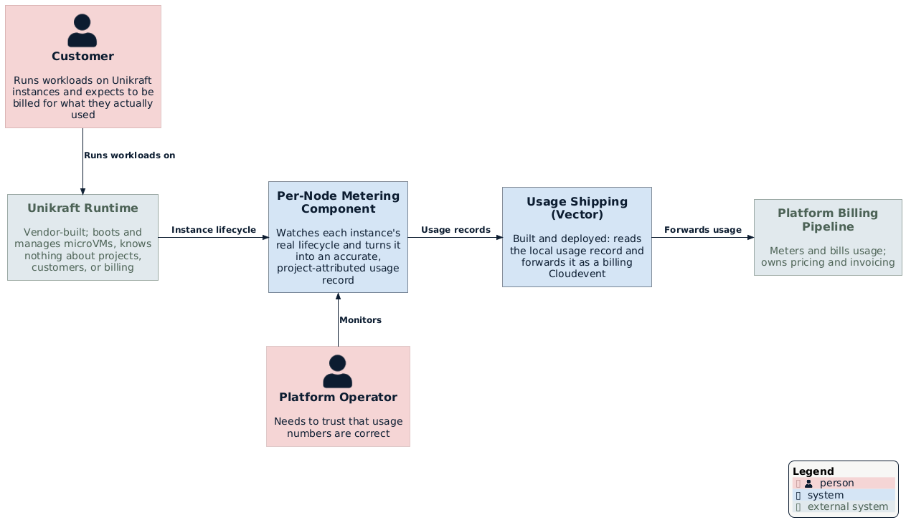
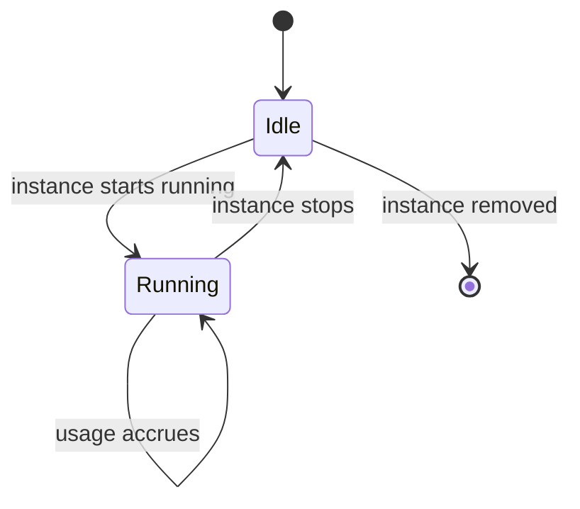
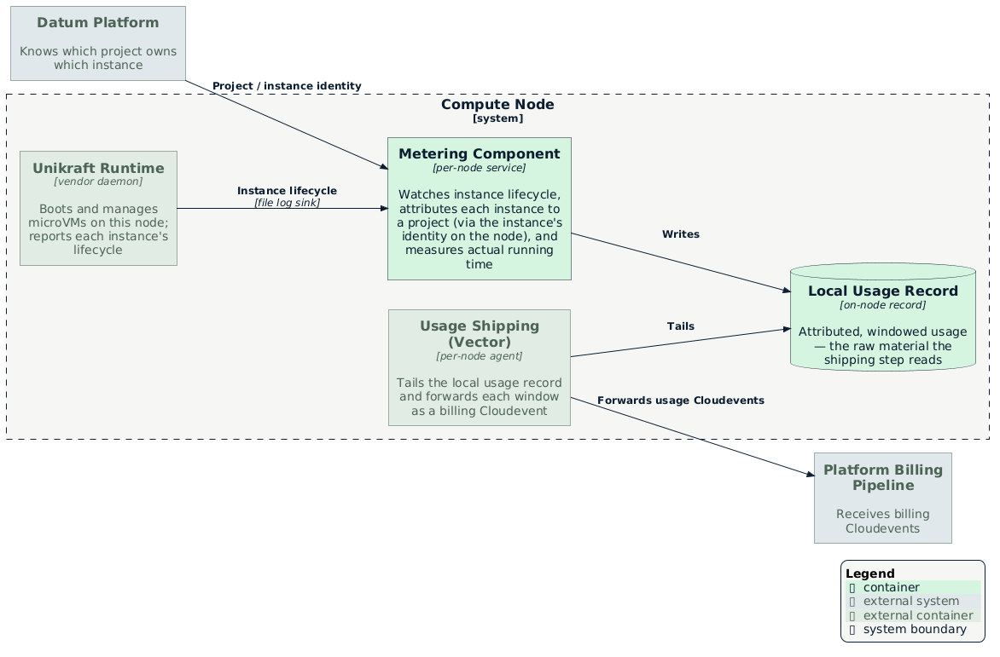

# Usage Metering for the Unikraft Runtime

**Issue:** [datum-cloud/unikraft-provider#5](https://github.com/datum-cloud/unikraft-provider/issues/5)

- [Summary](#summary)
- [Motivation](#motivation)
  - [Goals](#goals)
  - [Non-Goals](#non-goals)
- [Proposal](#proposal)
  - [Where This Fits](#where-this-fits)
  - [User Stories](#user-stories)
  - [How It Works](#how-it-works)
  - [Risks and Mitigations](#risks-and-mitigations)
- [Design Details](#design-details)
  - [The Per-Node Metering Component](#the-per-node-metering-component)
  - [The Shipping Step](#the-shipping-step)
- [Technical Details](#technical-details)
- [Drawbacks](#drawbacks)
- [Alternatives](#alternatives)
- [Implementation History](#implementation-history)
- [Infrastructure Needed](#infrastructure-needed)

## Summary

Today, running a Unikraft instance produces no usage data at all. The runtime is a
vendor-built system that only knows about virtual machines — it has no idea what a
project or a customer is, and no notion of billing. This enhancement adds a small
component, running on every node, that watches each instance's real lifecycle as it
happens and turns it into an accurate record: which project it belongs to, and exactly
how long it actually ran.

That record is the raw material a second, much simpler step uses: reading it and
forwarding it, in the platform's standard format, to wherever usage is ultimately
metered and billed. Both halves are now built. The first — producing an accurate,
attributed usage record — has been validated end to end, including against real
production traffic. The second — shipping that record onward — is implemented as a
Vector agent that tails the record and forwards it as a billing Cloudevent; the hard
problem here was never "how do we move data," it was "how do we know, correctly, what
happened and to whom."

## Motivation

The Unikraft runtime runs customer workloads as microVMs, but it was never built with
Datum's platform in mind. Left as-is, that creates three problems:

1. **No attribution.** The runtime has no concept of a project or a customer — it just
   knows a virtual machine started or stopped. Nothing connects that back to who should
   be billed.
2. **No accurate timing.** A workload that runs for ten seconds and one that runs for a
   week look identical unless something is actually tracking how long each one
   consumed resources.
3. **No usable output.** Even if the above were solved, there's nowhere for that
   information to go — no record a billing system could read.

Solving this means customers are charged for what they actually used, and only for as
long as they actually used it — not for whether they happened to leave something
provisioned.

### Goals

- Every instance's actual running time is measured accurately and attributed to the
  right project.
- Idle, stopped, or parked time is never counted — only time actually spent running.
- The measurement survives ordinary operational hiccups (a restart, a brief outage)
  without losing usage or counting it twice.
- The record this produces is self-contained and easy for anything downstream to
  consume, without needing to understand how the Unikraft runtime itself works.
- When something can't be measured correctly (for example, an instance whose project
  can't be determined), that's visible and loud — never a silent, wrong number.

### Non-Goals

- **Pricing, invoicing, or deciding what usage costs.** This produces usage data; it
  does not decide what anyone owes.
- **Metering anything that isn't actually running.** Reserved-but-idle capacity isn't
  billed through this mechanism.
- **Deciding how the runtime itself is configured or upgraded.** This works with
  whatever identity and lifecycle information the runtime already exposes on the node;
  it does not change the runtime's own behavior.

## Proposal

### Where This Fits

On every node that runs Unikraft instances, this component sits alongside the runtime
itself and watches its instance lifecycle directly, as it happens. It has no opinion
about pricing or invoicing — its only job is to answer, accurately: did this instance
run, for how long, and whose project was it.

### User Stories

**A short-lived workload is billed fairly.** A customer runs an instance for twelve
seconds. That's exactly what gets measured and attributed — not a rounded-up minimum,
not the length of some unrelated reporting interval.

**Idle costs nothing.** An instance that's provisioned but not actually running
accrues no usage while it sits idle. The moment it starts running again, measurement
picks back up.

**An operator trusts the numbers.** Whether the metering component restarts, or a
usage window is reported more than once due to a retry, the number that ultimately
lands is correct — never doubled, never silently lost.

**A misconfiguration is caught, not hidden.** If an instance's project can't be
determined for some reason, that's flagged loudly and visibly rather than quietly
attributing usage to the wrong place, or dropping it.

### How It Works

For each instance, the component watches for the moment it's actually running, and the
moment it stops. While it's running, that's a clock ticking; the moment it stops, the
clock closes and the elapsed time — along with how large the instance was (how much
compute and memory it used) — becomes one usage record, correctly attributed to the
right project. A long-running instance also reports incrementally along the way, so
usage is visible without having to wait for it to eventually stop.

This has been built and validated end to end — first in a full simulated environment,
and now confirmed against real production traffic: long-running instances are
correctly attributed to their real project, with the right size and elapsed time,
flushing incrementally as expected.

### Risks and Mitigations

- **An instance's project can't be determined.** Rather than guessing or silently
  attributing it to the wrong place, this is flagged clearly and the usage is still
  recorded with an explicit "unknown" marker — so the underlying data isn't lost and
  can be reconciled once the cause is fixed.
- **The component itself has an outage.** Any gap is bounded and self-heals on
  restart; a retried report never counts the same usage twice.
- **Local usage data could grow without bound.** The component manages this on its
  own, keeping only what's needed until the shipping step confirms it was picked up.
- **The runtime changes something this depends on.** This has already happened once —
  a networking change on the runtime silently broke how instances were identified —
  and the fix was to depend on a more fundamental, less coupled piece of identity
  instead of chasing the specific thing that changed. The same caution applies to the
  planned ingestion change below: prefer the option least coupled to incidental
  runtime behavior.

## Design Details

### The Per-Node Metering Component

One instance of this component runs on every node that hosts the Unikraft runtime,
because the fine-grained detail of exactly when an instance starts and stops running
is only visible right there, at the source. A central view of the fleet, elsewhere,
would not have that same immediacy or precision.

### The Shipping Step

This is built: a lightweight, widely used data-shipping tool (Vector) reads the usage
records this component produces and forwards them — translated into the platform's
standard billing Cloudevent format — to the billing pipeline. Because the hard problem
(accurate measurement and attribution) was already solved, this step turned out to be
exactly what it was expected to be: mostly transport and format, not new logic.

## Technical Details

The metering component is a small program written in Go, running as a sidecar
container inside the same per-node pod as the Unikraft runtime itself — one per
compute node, deployed and upgraded alongside the runtime rather than as a separate
rollout.

**Ingest.** It tails a plain file the runtime writes its lifecycle events to,
resuming from a saved position across its own restarts. This replaced an earlier
design where the runtime pushed events over a live Unix socket connection — that
had one real drawback: it required an active connection at the exact moment an
event fired, so a redeploy or brief crash of this component could miss an event a
live socket would have delivered. A file has no such requirement: the runtime
keeps appending regardless of whether anything is reading at that moment. This was
purely a resilience improvement to *how events arrive*; it changed nothing about
how usage is measured or attributed once they do.

**Attribute.** It separately keeps track of which project and instance each running VM
belongs to, by watching the cluster — the runtime itself has no notion of either.
Originally this join went through the instance's network address; that broke when a
networking change on the runtime stopped exposing it, so it was replaced with a more
direct piece of identity the runtime exposes per instance regardless of its network
configuration. The two are combined to produce each usage record, which is appended,
one per line, to a plain local file.

**Ship.** Reading that file and shipping it onward is handled by **Vector**, a widely
used open-source data-pipeline agent, running on each node as well (the file it reads
is local to that node). It tails the file as new lines are appended, and for each one
emits a billing Cloudevent — carrying the project, the instance, and the resource
consumption for that window (compute-time and memory-time) — to the platform's billing
pipeline.

## Drawbacks

- This adds one more running component per node, which is one more thing to operate
  and monitor.
- Because it watches the Unikraft runtime specifically, it doesn't generalize to any
  other kind of workload — a different runtime would need its own equivalent.

## Alternatives

- **Have the runtime itself understand projects and report usage natively.** Not
  possible — the runtime is a closed, vendor-built system, and it has no notion of
  Datum's projects or customers to begin with.
- **Measure and attribute usage from a central place instead of on each node.**
  Rejected — the moment-to-moment detail of when an instance is actually running only
  exists where the runtime itself runs. Observing it from further away would trade
  away exactly the precision this exists to provide.

## Implementation History

- The per-node metering component: **implemented and validated** end to end in a
  simulated environment, and **confirmed against real production traffic** —
  long-running instances are correctly attributed with the right project, size, and
  elapsed time.
- The instance-identity join it uses: **revised once already**. It originally went
  through the instance's network address; a networking change on the runtime broke
  that, and it was replaced with a more direct piece of identity — verified against
  the same production traffic above.
- The shipping step: **implemented and deployed** — a Vector agent tails the local
  usage record and forwards each window as a billing Cloudevent to the platform's
  billing pipeline.
- Ingestion (runtime → metering component): **migrated** from a Unix socket to a
  file the runtime writes and this component tails, for resilience to this
  component's own restarts.

## Infrastructure Needed

- ~~A data-shipping component, configured to read this component's output and forward
  it onward.~~ Done — deployed as part of the platform's existing Vector-based billing
  agent.
- A receiving side on the platform's billing pipeline able to accept what gets
  shipped — in place, since this reuses the same billing Cloudevent pipeline other
  usage sources already ship through.
- ~~A runtime configuration change to add a file-based event sink.~~ Done.
- **Not yet automated:** the runtime's own event file has no built-in size cap
  (vendor-confirmed), so something needs to periodically rotate it (an external
  rename + a signal to the runtime to reopen the file) before it grows unbounded
  on a shared volume. This is an operational gap, not a correctness one — the
  metering component tolerates the file being rotated whenever this is wired up.
